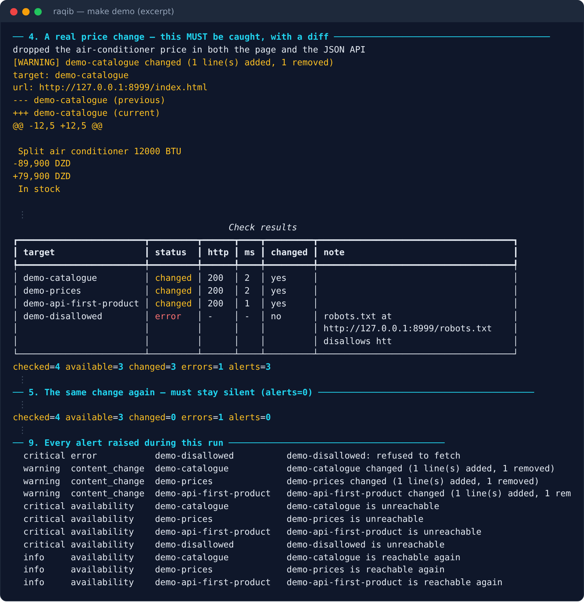

<div dir="rtl">

# raqib · رَقِيب

[English](README.md)

**يراقب صفحات الويب: تغيّر المحتوى، والتوافر، وتراجع إعدادات الأمان — على خادمك أنت ودون اشتراك
شهري لكل مراقبة. مبنيّ ليكون عميل شبكة مهذّبًا، لا أداة كشط.**



<sub>مخرجات حقيقية للأمر `make demo`، مقتطفة (العلامة `⋮` تعني أسطرًا محذوفة). يعمل على موقع تجريبي محلي فقط.</sub>

## المشكلة التي يحلّها

تريد أن تعرف متى غيّر المنافس أسعاره، أو متى نُشرت مناقصة جديدة، أو متى توقّف موقعك أو انتهت
شهادة TLS فيه — دون أن تفتح الصفحة كل ساعة، ودون تنبيه كاذب عند كل تحديث لساعة في أسفل الصفحة.

## ما الذي يقدّمه

- كشف تغيّر المحتوى بمحدِّد CSS أو بنص الصفحة، مع أنماط تجاهل تمنع التنبيهات الكاذبة.
- مراقبة التوافر، وتنبيه واحد لكل تغيّر حالة لا تنبيه عند كل فحص.
- فحص أمني سلبي: ترويسات الأمان، وأعلام الكوكيز، وانتهاء شهادة TLS، والمحتوى المختلط.
- حماية من SSRF مع تثبيت DNS، ورفض العناوين الخاصة افتراضيًا.
- احترام فعلي لـ robots.txt و Crawl-delay، و User-Agent يعرّف بنفسه.
- قنوات تنبيه: stdout وملف و webhook وتيليجرام، وتقارير HTML و Markdown.

## التشغيل السريع

```bash
make setup
make demo
```

العرض لا يتصل بأي شيء خارج جهازك: يشغّل موقعًا تجريبيًا محليًا ثم يُظهر كشف التغيّر والتنبيهات
واحترام robots.txt.

## التفويض

الفحص الأمني مخصّص للمواقع التي تملكها أو المأذون لك بفحصها. اقرأ قسم Authorisation في README
الإنجليزي قبل استعماله.

## الجودة

298 اختبارًا آليًا، مع ruff و mypy نظيفين، و CI على كل دفع.

## الحدود، بصراحة

- مشروع محفظة أعمال: لا مستخدمون في بيئة إنتاج.
- لا تنفيذ لـ JavaScript: الصفحات التي تبني محتواها في المتصفح تظهر فارغة.
- لا مراقبة للصفحات التي تتطلب تسجيل دخول.
- الفحوص متتابعة: مناسب لعشرات الأهداف لا للمئات.
- الفحص الأمني سطحي عمدًا، ولم يُجرَّب بعد على خادم HTTPS حقيقي بشهادة حقيقية.
- SQLite فقط، ولا واجهة ويب.

التفاصيل الكاملة في [README الإنجليزي](README.md).

## الترخيص

MIT

</div>
