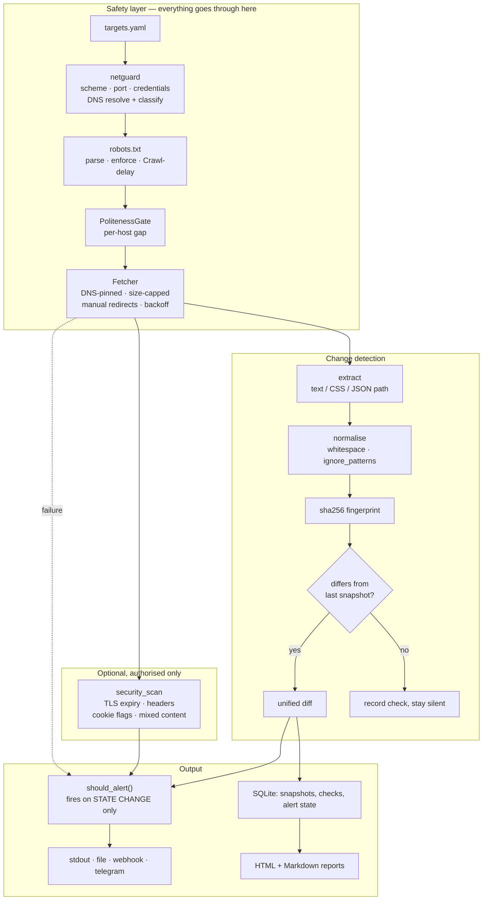

# raqib · رَقِيب

**Watch web pages for content changes, availability, and security-posture regressions — on your
own server, with no per-monitor monthly fee. Built to be a well-behaved network client, not a
scraper.**

> Arabic *رَقِيب* means "a watcher" or "a monitor".

[](https://www.python.org/)
[](#testing)
[](#testing)
[](LICENSE)

---

## The problem this solves

Three things change without anyone noticing, and each one costs money:

- **A page's content.** A competitor's price, a supplier's stock label, a tender listing, a
  regulation page. The manual alternative is a person refreshing a browser tab.
- **A site's availability.** Nobody finds out from a dashboard; they find out from a customer.
- **A site's security posture.** A `Content-Security-Policy` that vanished in a deploy. A session
  cookie that lost `Secure`. A TLS certificate expiring in nine days. Silent until it is an
  incident.

Commercial monitoring solves the first two, charges per monitor per month, and runs in someone
else's cloud. `raqib` runs on a €4 VPS or a Raspberry Pi, watches as many targets as you like,
and keeps the data on your machine.

## What makes it different from `curl` in a `while` loop

The naive version is four lines of shell. Here is what those four lines get wrong, and what this
does instead:

| | `curl` in a loop | `raqib` |
|---|---|---|
| **False positives** | Reports a change every single poll, because real pages carry a clock, a CSRF token, or a rotating advert | `ignore_patterns` + normalisation; a page whose only change is its timestamp reports **nothing** |
| **robots.txt** | Ignored | Parsed and **enforced**, including `Crawl-delay` — which `urllib.robotparser` ignores |
| **SSRF** | Will happily fetch `http://169.254.169.254/` and hand you cloud credentials | DNS resolved and classified **before** the request, every resolved address checked, connection pinned to the approved address |
| **Redirects** | Followed blindly to wherever they point | Followed manually so **each hop is re-validated** |
| **Alert fatigue** | One alert per poll while a condition persists | One alert per *state change* — a six-hour outage is one message, not seventy-two |
| **Politeness** | Fixed `sleep`, global | Per-host gap, honouring the site's own `Crawl-delay` when stricter |
| **Identity** | `curl/8.x`, or a faked browser string | An identifiable agent with contact info; a browser-impersonating one is **refused at startup** |
| **Memory** | `-o file` and hope | Bounded snapshot history, unified diffs, availability ratio |

## Architecture



### The three decisions that matter

**1. SSRF protection is not a hostname check.** A hostname allow-list is defeated by a domain
whose `A` record points at `127.0.0.1` — [`localtest.me`](https://readme.localtest.me/) does this
openly. So `raqib` resolves every name, classifies **every** returned address (loopback, private,
link-local, reserved, multicast, and IPv4-mapped/6to4 IPv6 that smuggle those in), and then
**pins the connection to the approved address** with a `Host` header. Without pinning, the HTTP
client would resolve again independently and leave a DNS-rebinding window — public for the check,
private microseconds later for the request. Redirects re-enter the same validation, which is why
`follow_redirects=True` is not used.

**2. `robots.txt` is enforced, not decorative.** The stdlib `urllib.robotparser` is deliberately
not used: it fetches the file itself with no timeout, no custom agent and no SSRF validation —
handing the one part of this tool that must be careful about network access to a component that
isn't — and it ignores `Crawl-delay`, which is exactly the directive a *polite* monitor should
obey. So the parser here takes text (no network of its own), implements longest-match precedence
with `Allow` winning ties, supports the `*` and `$` extensions every major crawler honours, and
reads `Crawl-delay`. If `robots.txt` cannot be read at all, the fetch **fails closed**.

**3. Alerts fire on state change, not on state.** A monitor that alerts every poll while a
condition persists is a monitor people mute, and a muted monitor is worse than none. Every alert
is keyed on a fingerprint of the current state, so a change alerts once, an outage alerts once,
a recovery alerts once, and repeats are silent.

## Quickstart

```bash
git clone <your-repo-url> raqib && cd raqib
make setup
make demo
```

`make demo` contacts **nothing outside your machine**. It serves the bundled demo site on
loopback and then demonstrates, in order:

1. Every target passing the SSRF guard before anything is fetched.
2. Baselines captured, and `robots.txt` **refusing** a disallowed path.
3. The page's timestamp changing — and **no change being reported** (the whole ball game).
4. A real price change being caught, with a diff.
5. The same state again — silence.
6. The site going down — reported as *unreachable*, once.
7. Still down — silence.
8. The site returning — one recovery alert.
9. Every alert raised, and both report formats.

## Usage

### Defining targets

`targets.yaml` (start from `targets.example.yaml`):

```yaml
targets:
  # Watch a competitor's price. The CSS selector keeps the comparison to the price table, so a
  # blog post elsewhere on the page does not register as a change.
  - name: competitor-prices
    url: https://example.com/products
    interval_minutes: 60
    extractor: css
    selector: "#price-table"

  # Watch a whole page. ignore_patterns is what makes this usable: without it, a page carrying
  # a "last updated" clock reports a change on every single poll.
  - name: tender-listings
    url: https://example.gov/tenders
    interval_minutes: 30
    extractor: text
    ignore_patterns:
      - '\d{2}:\d{2}:\d{2}'
      - 'Session ID: [a-f0-9]+'

  # Watch one value in a JSON API, by dotted path with [n] indexing.
  - name: stock-level
    url: https://example.com/api/products.json
    extractor: json
    selector: products[0].in_stock

  # Security posture. Requires `authorised: true` -- your attestation that this site is yours or
  # that you have written permission. See "Authorisation" below.
  - name: my-own-site
    url: https://my-own-site.example/
    interval_minutes: 1440
    extractor: text
    security_check: true
    authorised: true
```

### Commands

```bash
./.venv/bin/python -m raqib.cli validate          # check targets.yaml + SSRF-check every URL, no fetching
./.venv/bin/python -m raqib.cli check             # check every target once
./.venv/bin/python -m raqib.cli check --report    # ...and write HTML + Markdown reports
./.venv/bin/python -m raqib.cli watch             # run continuously on each target's interval
./.venv/bin/python -m raqib.cli history my-target # snapshots, recent checks, availability %
./.venv/bin/python -m raqib.cli diff my-target    # diff the two most recent snapshots
./.venv/bin/python -m raqib.cli forget my-target  # delete all stored history for a target
./.venv/bin/python -m raqib.cli config            # effective settings, secrets redacted
```

`check` exits non-zero when any target errored, so cron and CI can treat that as a failure:

```bash
*/30 * * * * cd /opt/raqib && ./.venv/bin/python -m raqib.cli check >> /var/log/raqib.log 2>&1
```

Or run it as a long-lived process with `watch`, which respects each target's own interval and
adds jitter so twenty targets on a 60-minute schedule do not all fire in the same second.

### Alerting

Four sinks, set with `RAQIB_ALERT_SINKS` (comma-separated):

| Sink | Use |
|---|---|
| `stdout` | Default. Enough for a cron job that mails its output. |
| `file` | JSON Lines — append-only, `grep`- and `jq`-friendly, survives a crash mid-write |
| `webhook` | POSTs JSON. Slack, Discord, n8n, anything. |
| `telegram` | Where small businesses actually read things. |

A target may narrow its own routing with `notify:`, listing the sink names its alerts should reach.
Omitting it — the usual case — sends to every configured sink. An unknown sink name is refused when
the targets file loads, so a typo cannot silently route a target's alerts to nowhere.

## Authorisation — read this before using `security_check`

Everything in the security assessment is **passive**. The only network traffic is one ordinary
`GET` that a browser would make anyway, plus one TLS handshake to read the certificate. There is
**no** vulnerability probing, payload injection, path or parameter guessing, fuzzing, brute force,
or authentication testing. Nothing here sends a request a normal visitor would not send.

That restriction is deliberate and permanent. Active scanning of a system you do not own is
unlawful in many jurisdictions regardless of intent, and it is not a capability this project will
grow.

On top of that, `security_check: true` requires `authorised: true` on the same target, and
**startup fails** if it is missing:

```
target 'x' requests security_check but has authorised: false. Set 'authorised: true' only for a
site you own or have written permission to assess.
```

That flag is your attestation. It is enforced in code, not merely documented — but code cannot
verify a legal fact, so the honesty is yours to supply.

**Content monitoring** carries a lighter but real obligation: `robots.txt` is honoured by
default, requests are rate-limited per host, and the user agent identifies the tool. Disabling
`RAQIB_RESPECT_ROBOTS` is supported for sites you own; the CLI prints a warning and every report
states it prominently when it is off.

## Configuration

Environment variables prefixed `RAQIB_`. See [`.env.example`](.env.example) for the annotated
list. **Defaults are the safe ones**: robots honoured, private addresses refused.

Startup refuses configurations that would be unsafe or incoherent:

| Misconfiguration | Result |
|---|---|
| A browser-impersonating `USER_AGENT` | Refused — a monitor must be distinguishable from an attack, and the site owner must be able to contact you |
| An empty or trivial `USER_AGENT` | Refused |
| `ALERT_SINKS=webhook` with no `WEBHOOK_URL` | Refused |
| `ALERT_SINKS=telegram` without both token and chat id | Refused |
| An unknown alert sink name | Refused, listing the valid ones |
| `security_check` without `authorised` | Refused |
| `extractor: css`/`json` with no `selector` | Refused |
| `extractor: text` **with** a `selector` | Refused — silently ignoring it would mislead you |
| An invalid regex in `ignore_patterns` | Refused at load time, not halfway through a run |
| A duplicate target name | Refused — names key snapshots, alert state and report filenames |
| A target name containing path characters | Refused — names become report filenames |
| Unknown keys in a target | Refused — a typo in YAML must not be silently ignored |

## Testing

```bash
make check      # ruff format --check + ruff check + mypy + pytest
```

Verified on Python 3.13.9, Linux, at the time of writing:

```
292 passed in 9.18s
Success: no issues found in 13 source files      # mypy
All checks passed!                               # ruff
```

The suite is **fully offline**. Web traffic is served by an in-process `httpx` mock transport, so
redirect handling, size caps, retry/backoff, robots enforcement and DNS pinning are all genuinely
exercised without touching the network.

Coverage is weighted by risk: **67 tests on the SSRF guard alone**, walking through each bypass
class (IPv4-mapped IPv6, 6to4, cloud metadata, a hostname resolving to loopback, a name with one
public and one private address, non-web ports, credentials in a URL, non-HTTP schemes). A gap
there turns a monitoring tool into a network-probing proxy, so it is tested like it matters.

## Security

| Concern | How it is handled |
|---|---|
| SSRF | Scheme allow-list, port block-list, DNS resolution + classification of **every** address before the request, connection pinned to the approved address, redirects re-validated per hop. 67 tests. |
| Cloud metadata | `169.254.169.254`, `fd00:ec2::254` and `100.100.100.200` named explicitly on top of the link-local rule, because they are the highest-value SSRF target. |
| Non-web ports | SSH, SMTP, Redis, MySQL, Postgres, MongoDB, Elasticsearch and others refused outright — this tool monitors web pages, not network services. |
| Credentials in URLs | Refused, not stripped. Stripping would silently accept them; they would otherwise land in the target file and in logs. |
| Response size | Streamed with a hard byte cap, so a huge or endless response cannot exhaust memory. |
| YAML loading | `yaml.safe_load`, never `load`. Full YAML can construct arbitrary Python objects, and a targets file is exactly the kind of thing that gets copied between machines. Tested. |
| Report rendering | Jinja2 autoescaping on. Reports contain third-party page content; without escaping, a monitored page containing a `<script>` tag would execute in your browser when you opened the report — a vulnerability introduced by the monitoring tool itself. Tested. |
| Report filenames | Target names are validated against path characters, and the report writer sanitises again at the point a name becomes a path. |
| SQL | Parameterised throughout; the only interpolation is a table name from a fixed internal tuple. |
| Secrets | `.env`, `data/`, `reports/` and `targets.yaml` are git-ignored; `.env.example` holds placeholders. Webhook URL and bot token use `repr=False`. |
| Log hygiene | Structured JSON logs carry target names, URLs, status codes, counts and timings — never fetched page bodies or diffs. |
| Shell execution | None. No fetched content or config value ever reaches a shell. |
| HTML parsing | Parsed, never executed, and never regex-matched for structure. |

## Limitations

Stated plainly.

1. **No JavaScript rendering.** A page that builds its content client-side will look empty or
   static. Playwright would fix it and would also mean a browser download and far more RAM than
   the 8 GB laptop this was built on. Out of scope for v1.
2. **No authenticated monitoring.** Login-gated pages are not supported. Storing customer
   credentials to scrape their own site is a liability this deliberately avoids.
3. **Checks are sequential.** One target at a time, in order. Fine for tens of targets on a
   schedule; hundreds would want async fan-out. There is deliberately **no** concurrency setting:
   an earlier version declared `max_concurrent_requests`, validated it, and documented it while
   never reading it at runtime. A knob that does nothing is worse than no knob, so it was removed
   rather than faked.
4. **Security assessment is passive and shallow by design.** Headers, cookie flags, TLS expiry,
   mixed content. It will not find an injection flaw, and is not trying to.
5. **The security score is a blunt instrument.** A 0–100 deduction from a fixed weight table. Its
   only real job is to show *movement* between two runs; do not read it as an audit grade.
6. **`robots.txt` is cached for the process lifetime.** A long-running `watch` will not notice a
   site publishing new rules until restarted.
7. **Single-process, single-machine.** No clustering, no shared state. Two instances watching the
   same targets would each keep their own history and alert independently.
8. **SQLite only.** Correct for one operator; no Postgres path is implemented.
9. **No web UI.** CLI plus HTML reports. There is no dashboard.
10. **`Crawl-delay` is honoured but `Request-rate` is not.** The latter is rare and
    inconsistently implemented.

## Troubleshooting

**`refusing to fetch …: it resolves to a private address`** — working as intended. If it really
is a local test server you control, set `RAQIB_ALLOW_PRIVATE_TARGETS=true`; the CLI will warn on
every run while it is on.

**`refusing a browser-impersonating user agent`** — set `RAQIB_USER_AGENT` to something that
names this tool and gives a contact URL.

**`robots.txt … disallows …`** — the site has asked monitors not to fetch that path. The correct
response is to pick a different URL, or to get the owner's permission and only then consider
`RAQIB_RESPECT_ROBOTS=false`.

**`could not read …/robots.txt … the host appears to be unreachable`** — an **outage**, not a
robots problem. `robots.txt` is fetched first, so when a host is down that request fails too.
The message distinguishes the two cases deliberately.

**Every poll reports a change** — the page contains something volatile. Run
`raqib diff <target>` to see exactly what moves, then add an `ignore_patterns` entry for it, or
narrow the target with a CSS selector.

**`selector … matched no elements`** — the page was redesigned and the element is gone. This is
reported as an error rather than ignored, because silently comparing nothing forever looks
identical to "nothing ever changes".

**`port 8999 is already in use`** from the demo — something else is on that port. Stop it, or run
`PORT=9001 ./scripts/demo.sh`. The check exists because a leftover server silently made the demo
monitor the wrong content during development.

**A target shows `first` forever** — it is erroring before a snapshot is stored. Check the `note`
column, or run `raqib history <target>`.

## Implementation status

Every row was verified by running the code.

| Feature | Status |
|---|---|
| SSRF guard: schemes, ports, credentials, DNS classification, IPv4-mapped/6to4 | ✅ 67 tests |
| DNS pinning into the connection | ✅ Implemented and tested |
| Manual redirect following with per-hop re-validation | ✅ Tested, including a redirect to loopback |
| `robots.txt` parse + enforce + `Crawl-delay` | ✅ 30 tests; enforcement verified live in the demo |
| Per-host politeness gate | ✅ Tested |
| Retry with exponential backoff and jitter | ✅ Tested |
| Response size cap (streamed) | ✅ Tested |
| Extractors: whole text / CSS selector / JSON path | ✅ 24 tests |
| `ignore_patterns` false-positive suppression | ✅ Tested, and demonstrated live |
| Snapshot history with pruning, unified diffs | ✅ Tested |
| Alerting on state change only | ✅ Tested; full lifecycle verified live |
| Alert sinks: stdout, file, webhook, telegram | ⚠️ All four implemented. stdout and file **run in the demo**; webhook and telegram are tested against a mock transport but have **not** been pointed at a real endpoint. |
| Per-target alert routing (`notify:`) | ✅ Implemented and tested; unknown sink names refused when the targets file loads |
| Passive security assessment | ✅ 27 tests. Exercised against the local demo site; **not** yet run against a real HTTPS host with a real certificate. |
| HTML + Markdown reports | ✅ Generated and opened |
| Scheduler with jitter | ✅ Tested |
| JavaScript rendering | ❌ Not implemented |
| Authenticated monitoring | ❌ Not implemented |
| Web dashboard | ❌ Not implemented |

The two ⚠️ rows are the honest boundary of what has been *executed*: the HTTP contracts and error
handling are covered by tests against a mock transport, but no real webhook has received a POST
from this code, and the TLS-certificate path has only ever seen a local plain-HTTP server.

## Roadmap

1. Point the webhook and Telegram sinks at real endpoints, and the security assessment at a real
   HTTPS host, then update the two ⚠️ rows.
2. Re-check `robots.txt` on a TTL so a long `watch` picks up new rules.
3. Async fan-out with a real concurrency limit, for hundreds of targets.
4. Optional Playwright renderer behind a flag, for JavaScript-built pages.
6. Uptime summaries over a chosen window in the report.

## Project layout

```
src/raqib/
├── netguard.py        SSRF guard: the first thing in the package, on purpose
├── robots.py          robots.txt parser and matcher (no network of its own)
├── fetcher.py         DNS-pinned HTTP client: politeness, size cap, redirects, retries
├── extract.py         text / CSS / JSON extraction and normalisation
├── security_scan.py   passive TLS, header, cookie and mixed-content assessment
├── storage.py         SQLite snapshots, checks, alert de-duplication
├── alerting.py        Alert + four sinks + dispatcher
├── monitor.py         orchestration, diffing, alert rules, scheduler
├── reports.py         HTML + Markdown rendering
├── config.py          Settings and the WatchTarget model
├── cli.py             Typer CLI
└── templates/         self-contained report templates
demo_site/             bundled fixture site, including a robots.txt that forbids a path
tests/                 292 tests, fully offline
```

## Sample data

`demo_site/` is fictional content written for this demo — a made-up shop with three products. It
describes no real business. The demo copies it to a temporary directory before editing, so
running the demo never dirties the repository.

## License

MIT — see [LICENSE](LICENSE).
